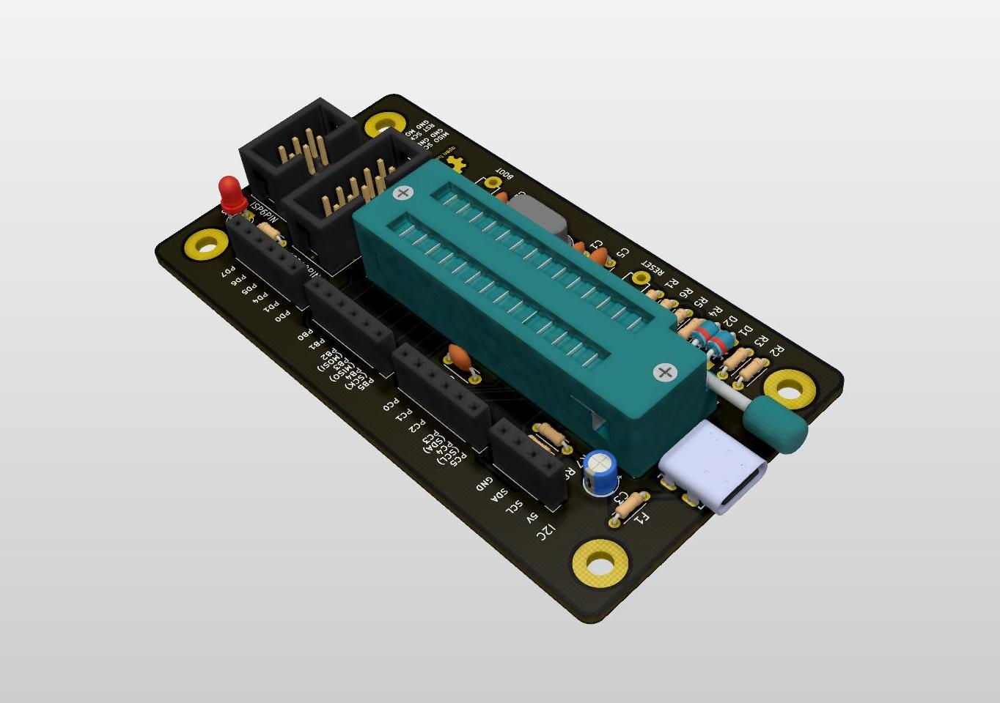
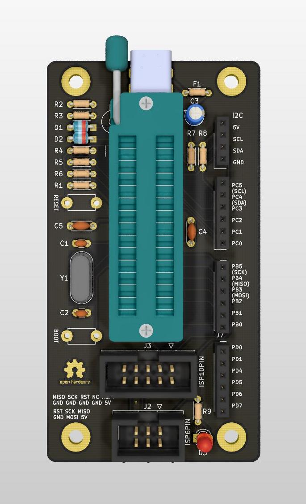
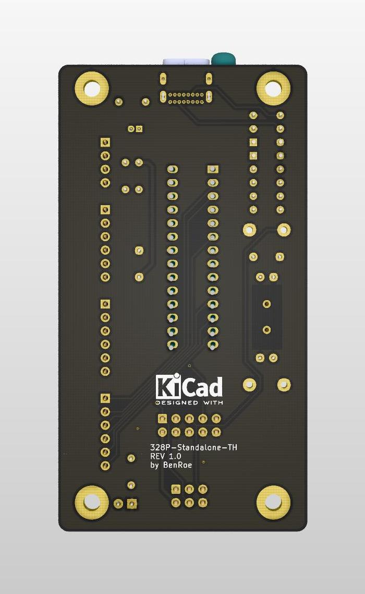

# 328p-Standalone-TH

A only through hole components development board for the Atmega328P with USB-C connector.  
It's also very handy to flash the bootloader on many Atmega328P IC's.

## Features

- ISP 6/10 header for bootloader flashing (recommend [USBaspLoader](https://github.com/baerwolf/USBaspLoader))
- USB-C connector (if USBaspLoader bootloader is on the Atmega328P, you can flash the firmware via USB)
- ISP activity led (MISO Pin)
- Boot/Reset switch
- [ZIF](https://en.wikipedia.org/wiki/Zero_insertion_force) socket for easy MCU swap
  
 

- [BOM](http://htmlpreview.github.io/?https://github.com/BenRoe/atmega328p-standalone-board/blob/master/bom/ibom.html)
- [Gerber files](gerber/328p-standalone-rev1.0.zip) (ready to use)